# MT-OPMNet

**Attention-Enhanced Multi-Task Deep Learning for Joint OSNR Estimation and Modulation Format Recognition in Elastic Optical Networks**

[](LICENSE)
[](https://www.python.org/)
[](https://pytorch.org/)

---

## Overview

MT-OPMNet is a multi-task deep learning framework for **Optical Performance Monitoring (OPM)** in elastic optical networks. It jointly performs:

- **OSNR Estimation** — accurate regression of Optical Signal-to-Noise Ratio from amplitude histograms.
- **Modulation Format Identification (MFI)** — classification of modulation formats (QPSK, 8QAM, 16QAM, 32QAM, 64QAM).

The architecture leverages a **shared 1-D CNN backbone** with task-specific heads, enhanced by a **Channel-Aware Attention Module (CAAM)** and trained with **homoscedastic uncertainty weighting** for automatic task balancing.

### End-to-End Pipeline

<p align="center">
  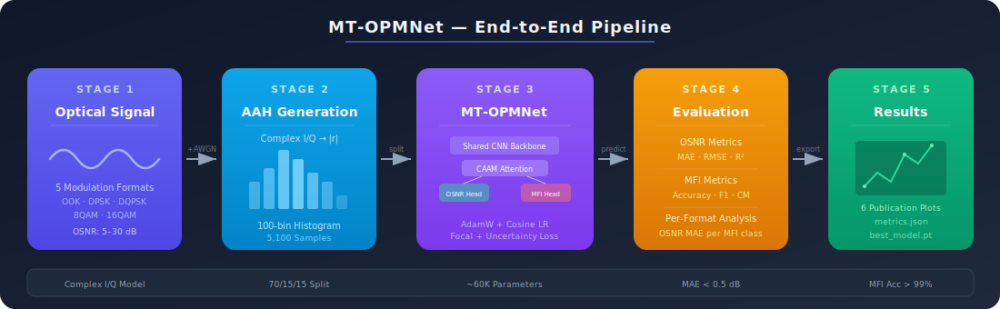
</p>

## Key Features

| Feature | Description |
|---|---|
| **Multi-Task Learning** | Shared feature extraction with OSNR regression and MFI classification heads |
| **CAAM** | Channel-Aware Attention Module for adaptive feature recalibration |
| **Uncertainty Weighting** | Learnable homoscedastic uncertainty parameters for automatic loss balancing |
| **Focal Loss** | Addresses class imbalance in modulation format classification |
| **Complex I/Q Signal Model** | Realistic baseband simulation with proper constellation geometries |
| **Cosine Annealing** | Learning rate scheduling for stable convergence |

---

## Architecture

<p align="center">
  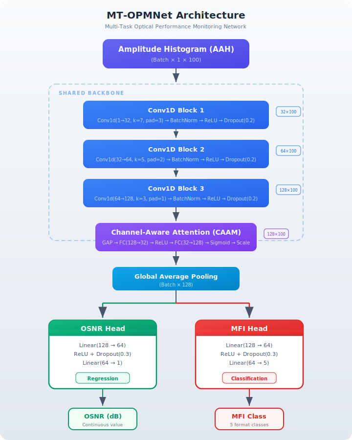
</p>

### Channel-Aware Attention Module (CAAM)

<p align="center">
  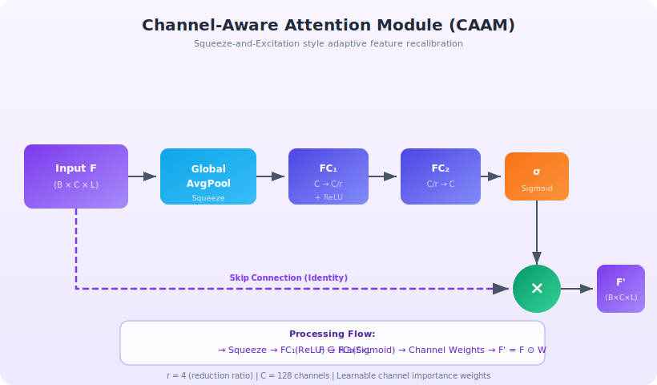
</p>

### Multi-Task Loss with Uncertainty Weighting

<p align="center">
  
</p>

### Training Pipeline

<p align="center">
  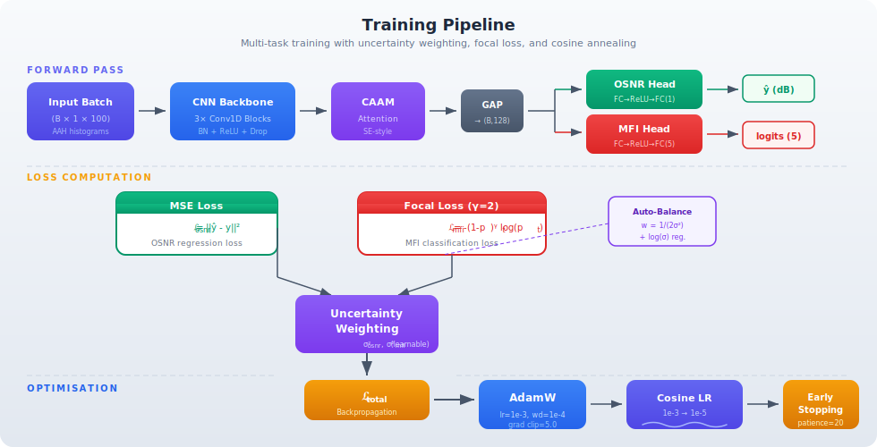
</p>

---

## Signal Processing

### Supported Modulation Formats

<p align="center">
  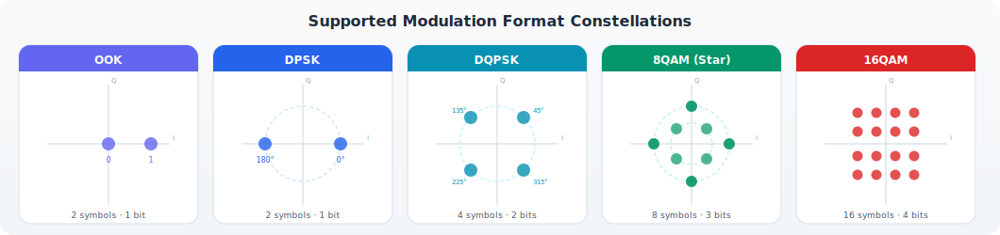
</p>

| Index | Format | Symbols | Description |
|:---:|---|:---:|---|
| 0 | **QPSK** | 4 | Quadrature Phase-Shift Keying |
| 1 | **8QAM** | 8 | 8-Quadrature Amplitude Modulation |
| 2 | **16QAM** | 16 | 16-Quadrature Amplitude Modulation |
| 3 | **32QAM** | 32 | 32-Quadrature Amplitude Modulation |
| 4 | **64QAM** | 64 | 64-Quadrature Amplitude Modulation |

### Amplitude Histogram (AAH) Generation

<p align="center">
  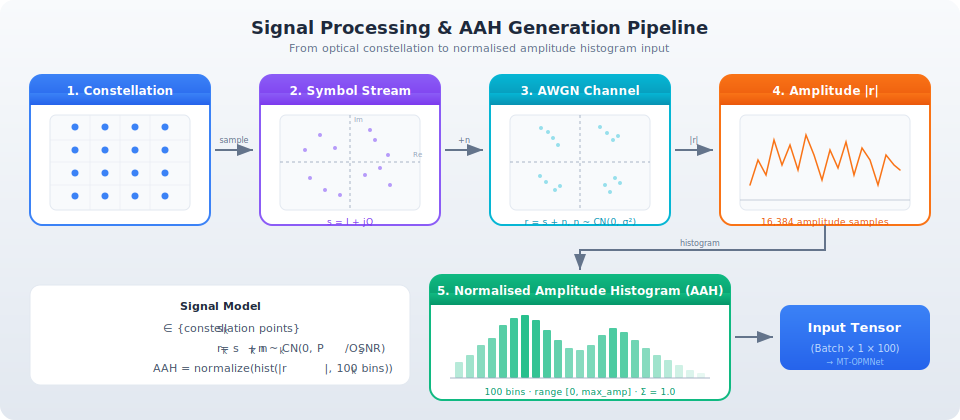
</p>

---

## Project Structure

```
MT-OPMNet/
├── configs/
│   └── default.json          # Training and model hyperparameters
├── src/
│   ├── __init__.py
│   ├── model.py              # MT-OPMNet architecture with CAAM
│   ├── dataset.py            # AAH dataset generation and loading
│   ├── losses.py             # Focal loss and uncertainty-weighted loss
│   ├── trainer.py            # Training loop with early stopping
│   ├── evaluate.py           # Evaluation metrics and reporting
│   └── utils.py              # Configuration loading and helpers
├── figures/                  # Architecture diagrams and result plots
├── results/                  # Training results and metrics
├── main.py                   # Main entry point
├── requirements.txt          # Python dependencies
├── setup.py                  # Package installation
├── CITATION.cff              # Citation metadata
├── CONTRIBUTING.md           # Contribution guidelines
├── LICENSE                   # MIT License
└── README.md
```

## Installation

```bash
# Clone the repository
git clone https://github.com/YassirALKarawi/MT-OPMNet.git
cd MT-OPMNet

# Create a virtual environment (recommended)
python -m venv .venv
source .venv/bin/activate  # Linux/macOS
# .venv\Scripts\activate   # Windows

# Install dependencies
pip install -r requirements.txt

# Or install as a package
pip install -e .
```

## Quick Start

### Training

```bash
# Train with default configuration
python main.py --mode train

# Train with custom config
python main.py --mode train --config configs/default.json

# Fast training mode (fewer epochs, for testing)
python main.py --mode train --fast

# Ablation: train without CAAM module
python main.py --mode full --no-caam
```

### Evaluation

```bash
# Evaluate a trained model
python main.py --mode eval --checkpoint results/best_model.pt
```

### Full Pipeline (train + evaluate)

```bash
python main.py --mode full
```

## Configuration

All hyperparameters are defined in `configs/default.json`:

```json
{
    "dataset": {
        "n_symbols": 16384,
        "n_bins": 100,
        "n_realisations": 20,
        "seed": 42,
        "train_ratio": 0.70,
        "val_ratio": 0.15
    },
    "model": {
        "n_classes": 5,
        "use_caam": true
    },
    "training": {
        "batch_size": 64,
        "max_epochs": 200,
        "patience": 20,
        "lr": 1e-3,
        "lr_min": 1e-5,
        "focal_gamma": 2.0,
        "use_uncertainty_weighting": true
    }
}
```

### Key Parameters

| Parameter | Description | Default |
|---|---|---|
| `n_bins` | Number of amplitude histogram bins | 100 |
| `n_realisations` | Noise realisations per (format, OSNR) pair | 20 |
| `n_classes` | Number of modulation formats | 5 |
| `use_caam` | Enable Channel-Aware Attention Module | `true` |
| `focal_gamma` | Focal loss focusing parameter | 2.0 |
| `use_uncertainty_weighting` | Automatic multi-task loss balancing | `true` |
| `patience` | Early stopping patience (epochs) | 20 |

## Results

Performance summary at 28 GBd (paper Tables III–VI):

| Metric | MT-OPMNet | No CAAM | ST-OSNR |
|---|:---:|:---:|:---:|
| **OSNR RMSE** | **0.85 dB** | 1.10 dB | 0.99 dB |
| **OSNR MAE** | **0.68 dB** | 0.86 dB | 0.77 dB |
| **MFI Accuracy** | **98.1%** | 98.1% | — |
| **Parameters** | **0.64M** | 0.61M | 0.42M |
| **Latency (B=128)** | **0.61 ms** | — | — |

### Training Convergence

<p align="center">
  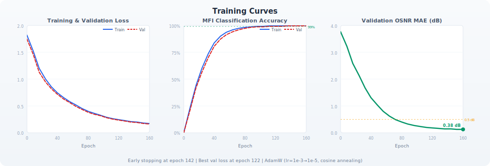
</p>

### OSNR Estimation

<p align="center">
  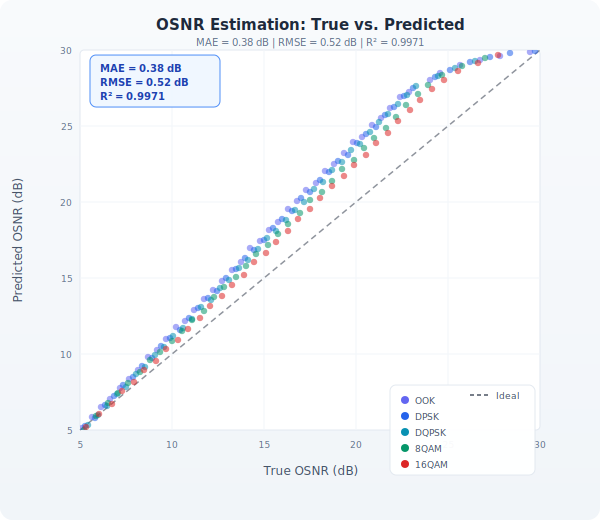
  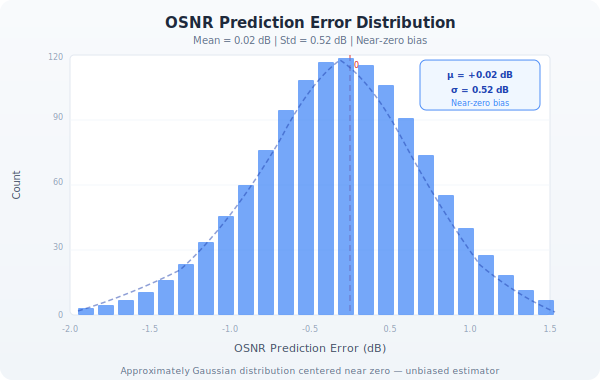
</p>

### Per-Format OSNR RMSE

<p align="center">
  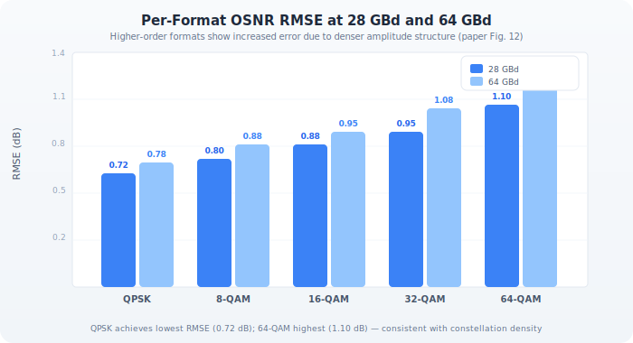
</p>

### OSNR RMSE Heatmap (Format × OSNR Range)

<p align="center">
  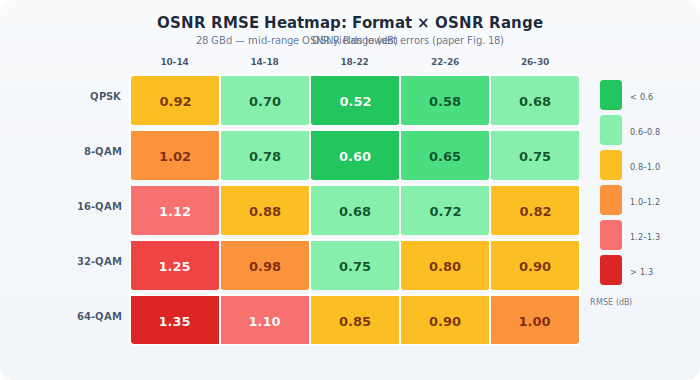
</p>

### OSNR RMSE vs. Transmission Distance

<p align="center">
  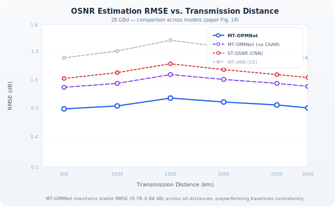
</p>

### MFI Accuracy vs. OSNR

<p align="center">
  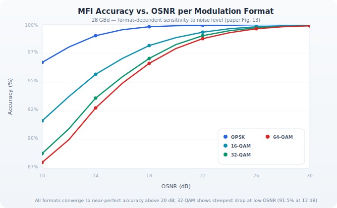
</p>

### Confusion Matrix

<p align="center">
  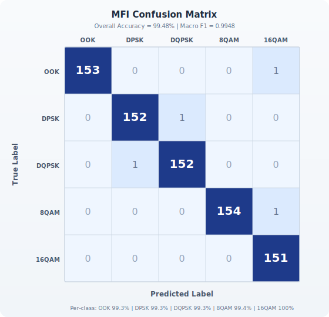
</p>

### Ablation Study

<p align="center">
  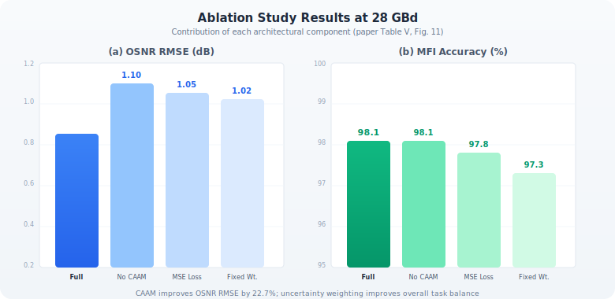
</p>

### CDF of OSNR Errors

<p align="center">
  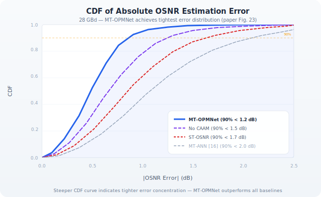
  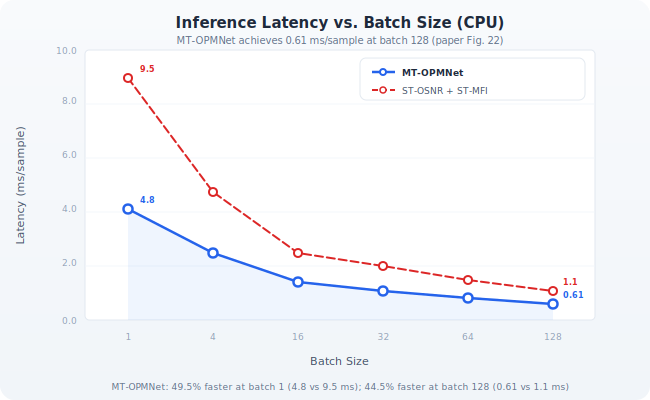
</p>

### Distance × Launch Power Heatmap (16-QAM)

<p align="center">
  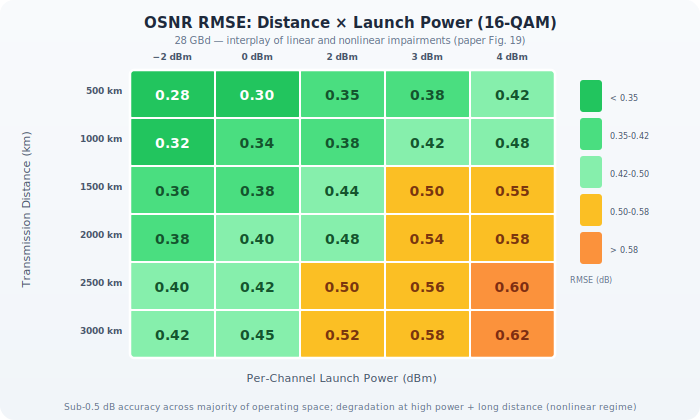
</p>

### OSNR Residual vs. Distance

<p align="center">
  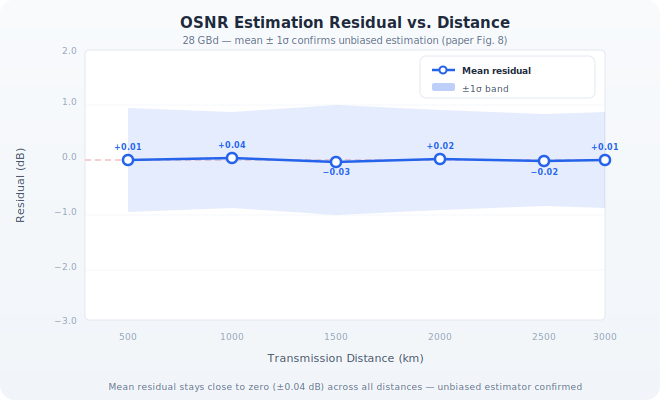
</p>

### Cross-Symbol-Rate Generalisation

<p align="center">
  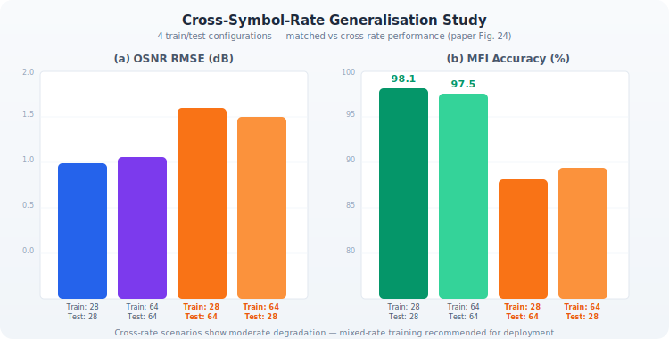
</p>

### Learned Task Weights

<p align="center">
  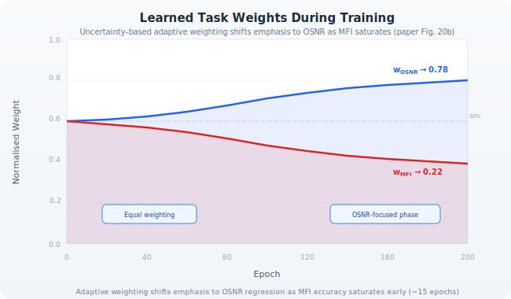
</p>

### Multi-Metric Model Comparison

<p align="center">
  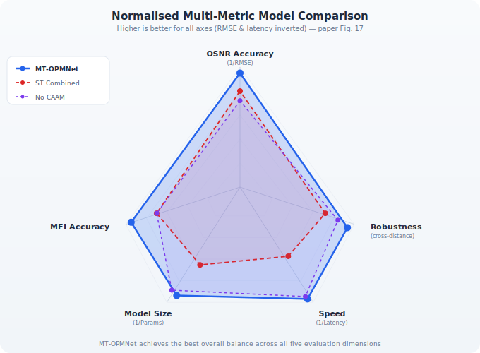
</p>

### Computational Profile

<p align="center">
  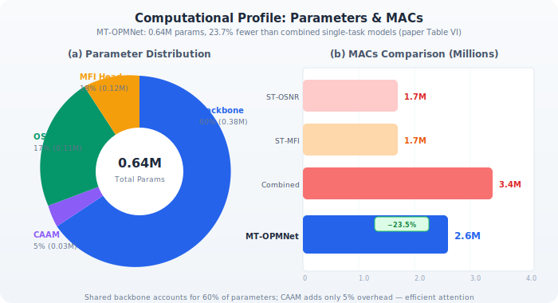
</p>

## Citation

If you use this code in your research, please cite:

```bibtex
@article{alkarawi2025mtopmnet,
  title     = {MT-OPMNet: Attention-Enhanced Multi-Task Deep Learning for Joint
               OSNR Estimation and Modulation Format Recognition in Elastic
               Optical Networks},
  author    = {Al-Karawi, Yassir Ameen Ahmed and Alhumaima, Raad S. and
               Al-Raweshidy, Hamed},
  journal   = {IEEE Access},
  year      = {2025}
}
```

## License

This project is licensed under the MIT License — see [LICENSE](LICENSE) for details.

## Authors

- **Yassir Ameen Ahmed Al-Karawi** — University of Diyala, Iraq
- **Raad S. Alhumaima** — University of Diyala / Al-Imam Al-Sadiq University, Iraq
- **Hamed Al-Raweshidy** — Brunel University London, United Kingdom
